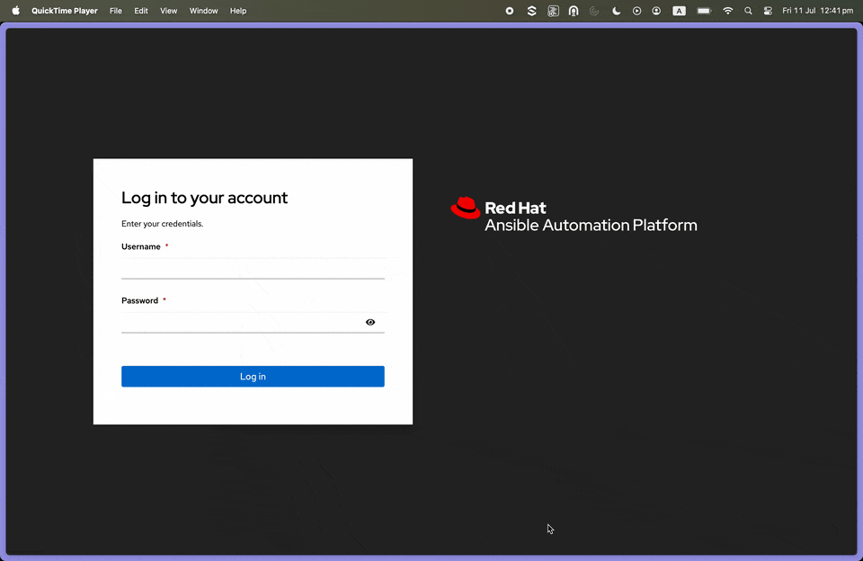

# MCP Ansible Automation Platform Server

A Very basic and simple Model Context Protocol (MCP) server that provides integration with Ansible Automation Platform (AAP) via API. This server allows Large Language Models to interact with AAP to extract available templates and launch Ansible job templates with custom parameters. This is just a demo, and not a full MCP Server capabiliy, feel free to use this code as you want.

**Note**: This server uses **fastMCP** with HTTP/SSE transport instead of the traditional stdio approach, making it more scalable and easier to debug.


## Features

- **Template Discovery**: Extract available job templates from configured AAP projects
- **Job Launching**: Launch Ansible job templates with custom extra variables and parameters
- **Job Monitoring**: Check job status and retrieve job outputs/logs
- **Connection Testing**: Verify AAP connectivity and authentication
- **Error Handling**: Robust error handling with retry logic and detailed error messages
- **HTTP/SSE Transport**: Uses Server-Sent Events for efficient, scalable communication
- **FastMCP Framework**: Built on the modern fastMCP framework for simplified development

## Prerequisites

- Python 3.8+
- Access to an Ansible Automation Platform instance
- AAP API access token with appropriate permissions

## AAP Token Generation



## Installation

1. Clone this repository

2. Install dependencies:
   ```bash
   pip install -r requirements.txt
   ```

   Or using uv:
   ```bash
   uv pip install -r requirements.txt
   ```

3. Configure environment variables:
   ```bash
   cp env_example .env
   # Edit .env with your AAP configuration
   ```

## Configuration

Create a `.env` file in the project root with the following variables:

```bash
# Ansible Automation Platform Configuration
AAP_URL=https://your-aap-instance.com
AAP_TOKEN=your-access-token-here
AAP_PROJECT_ID=your-project-id
AAP_VERIFY_SSL=True

# Optional settings
AAP_TIMEOUT=30
AAP_MAX_RETRIES=3
```

### Configuration Parameters

- `AAP_URL`: Base URL of your AAP instance (e.g., `https://controller.example.com`)
- `AAP_TOKEN`: Bearer token for API authentication
- `AAP_PROJECT_ID`: Default project ID to extract templates from
- `AAP_VERIFY_SSL`: Whether to verify SSL certificates (True/False)
- `AAP_TIMEOUT`: Request timeout in seconds (default: 30)
- `AAP_MAX_RETRIES`: Number of retry attempts for failed requests (default: 3)

## Usage

### Testing the Server

Before integrating with Claude Desktop, test your server setup:

1. **Test AAP Connection and MCP Server:**
   ```bash
   python tools/test_mcp_server.py
   ```

   This will validate:
   - Environment configuration
   - AAP connection
   - Template extraction
   - MCP server functionality

2. **Test HTTP Server (after starting server):**
   ```bash
   # In one terminal, start the server:
   python server.py

   # In another terminal, test the HTTP endpoints:
   python tools/test_http_server.py
   ```

   This will validate:
   - Server is running and accessible
   - SSE endpoint is working

### Running the Server

Start the MCP server:

```bash
python server.py
```

Or using uv:

```bash
uv run python server.py
```

The server will start and listen for MCP protocol messages on HTTP using Server-Sent Events (SSE) at `http://127.0.0.1:8000`.

### Running with Containers (Podman/Docker)

You can run the MCP server in a container using Podman or Docker.

#### Quick Start (Recommended)

Use the convenience script to build and run the container:

```bash
# Build and start the container
./run-container.sh start

# View logs
./run-container.sh logs

# Check status
./run-container.sh status

# Stop the container
./run-container.sh stop
```

**Note:** Make sure your `.env` file is configured before running the container.

#### Manual Container Commands

##### Build the Container Image

```bash
# Using Podman
podman build -t quay.io/jwerak/mcp-server-aap:latest .
podman push quay.io/jwerak/mcp-server-aap:latest
```

##### Run the Container

**Option 1: Using environment variables directly**

```bash
podman run -d \
  --name mcp-server-aap \
  -p 8000:8000 \
  -e AAP_URL="https://your-aap-instance.com" \
  -e AAP_TOKEN="your-access-token-here" \
  -e AAP_PROJECT_ID="your-project-id" \
  -e AAP_VERIFY_SSL="True" \
  quay.io/jwerak/mcp-server-aap:latest
```

**Option 2: Using .env file**

```bash
podman run -d \
  --name mcp-server-aap \
  -p 8000:8000 \
  --env-file .env \
  quay.io/jwerak/mcp-server-aap:latest
```

#### Access the Server

Once the container is running, the server will be accessible at:
- `http://localhost:8000` (from host machine)
- `http://127.0.0.1:8000` (Streamable HTTP endpoint for MCP clients)

### Deploying to OpenShift

For production deployments on OpenShift, this project includes complete Kubernetes manifests and Kustomize configurations.

#### Quick Start

```bash
# Build and push container image
podman build -t quay.io/your-org/mcp-server-aap:latest -f Containerfile .
podman push quay.io/your-org/mcp-server-aap:latest

# Create namespace and secret
oc new-project mcp-server-aap-dev
oc create secret generic dev-mcp-server-aap-secret \
  --from-literal=aap-token='YOUR_AAP_TOKEN' \
  -n mcp-server-aap-dev

# Deploy using Kustomize
oc apply -k k8s/overlays/dev

# Get the HTTPS route
oc get route -n mcp-server-aap-dev
```

#### Features

- ✅ **HTTPS Route**: Automatic TLS termination with edge routing
- ✅ **ConfigMaps & Secrets**: Separate storage for sensitive and non-sensitive config
- ✅ **Kustomize**: Base configuration with dev/prod overlays
- ✅ **Security**: Non-root containers, security contexts, health checks
- ✅ **Scalability**: Resource limits, horizontal scaling support
- ✅ **Multi-Environment**: Separate dev and prod configurations

#### Documentation

- **Quick Start**: See [DEPLOYMENT.md](DEPLOYMENT.md) for rapid deployment
- **Comprehensive Guide**: See [k8s/README.md](k8s/README.md) for detailed instructions
- **Summary**: See [k8s/SUMMARY.md](k8s/SUMMARY.md) for an overview of what's included

#### Directory Structure

```
k8s/
├── base/                   # Base Kubernetes resources
│   ├── deployment.yaml    # App deployment with ConfigMap/Secret
│   ├── service.yaml       # ClusterIP service
│   ├── route.yaml         # OpenShift HTTPS route
│   ├── configmap.yaml     # Non-sensitive configuration
│   ├── secret.yaml        # AAP token (template)
│   └── kustomization.yaml
└── overlays/
    ├── dev/               # Development environment
    └── prod/              # Production environment
```

### Claude Desktop Integration

#### Step 1: Start the Server

First, ensure your `.env` file is configured with your AAP credentials, then start the server:

```bash
python server.py
```

The server will start on `http://127.0.0.1:8000`.

#### Step 2: Configure Claude Desktop

1. Locate your Claude Desktop configuration file:
   - **macOS**: `~/Library/Application Support/Claude/claude_desktop_config.json`
   - **Windows**: `%APPDATA%\Claude\claude_desktop_config.json`
   - **Linux**: `~/.config/claude/claude_desktop_config.json`

2. Edit the configuration file and add the MCP server using Streamable HTTP transport:

```json
{
  "mcpServers": {
    "ansible-aap": {
      "url": "http://127.0.0.1:8000"
    }
  }
}
```

**Note**: The server must be running before Claude Desktop can connect to it.

#### Step 3: Restart Claude Desktop

After saving the configuration, restart Claude Desktop completely.

#### Step 4: Test the Integration

Once restarted, you can test the integration by asking Claude questions like:

- "What Ansible templates are available?"
- "Show me the job templates from my AAP project"
- "Show nodes with with low disk space"
- "Check the status of job 123"

#### Step 5: Verify Connection

You should see Claude respond with information about your Ansible templates and be able to launch jobs. If there are issues, check:

1. The MCP server is running (`python server.py`)
2. Claude Desktop logs for error messages
3. Your AAP credentials in the `.env` file
4. Network connectivity to your AAP instance
5. The server is accessible at `http://127.0.0.1:8000`

### Available Tools

The server provides the following tools:

#### 1. `get_job_templates`
Extract available job templates from the configured AAP project.

**Parameters:**
- `project_id` (optional): Override the configured project ID

**Example:**
```json
{
  "name": "get_job_templates",
  "arguments": {
    "project_id": "5"
  }
}
```

#### 2. `launch_job_template`
Launch an Ansible job template with optional parameters.

**Parameters:**
- `template_id` (required): ID of the job template to launch
- `extra_vars` (optional): Extra variables to pass to the job template
- `inventory` (optional): Inventory ID to use
- `credentials` (optional): List of credential IDs to use

**Example:**
```json
{
  "name": "launch_job_template",
  "arguments": {
    "template_id": 10,
    "extra_vars": {
      "target_host": "web-server-01",
      "service_name": "nginx",
      "restart_service": true
    },
    "inventory": 2
  }
}
```

#### 3. `get_job_status`
Get the status and details of a running or completed job.

**Parameters:**
- `job_id` (required): ID of the job to check

**Example:**
```json
{
  "name": "get_job_status",
  "arguments": {
    "job_id": 123
  }
}
```

#### 4. `get_job_output`
Get the output/logs of a job.

**Parameters:**
- `job_id` (required): ID of the job to get output from

**Example:**
```json
{
  "name": "get_job_output",
  "arguments": {
    "job_id": 123
  }
}
```

#### 5. `test_aap_connection`
Test the connection to Ansible Automation Platform.

**Parameters:** None

**Example:**
```json
{
  "name": "test_aap_connection",
  "arguments": {}
}
```

## Integration with LLM Clients

This server can be integrated with various MCP-compatible LLM clients. The server provides a standardized interface for LLMs to:

1. **Discover Infrastructure**: Query available Ansible templates to understand what automation is available
2. **Execute Operations**: Launch specific templates with custom parameters based on the conversation context
3. **Monitor Progress**: Check job status and retrieve outputs to provide feedback to users

### Example LLM Interaction Flow

1. **Discovery**: LLM calls `get_job_templates` to see what automation is available
2. **Planning**: Based on user request, LLM identifies the appropriate template and parameters
3. **Execution**: LLM calls `launch_job_template` with the required parameters
4. **Monitoring**: LLM uses `get_job_status` and `get_job_output` to track progress and provide updates

## Error Handling

The server includes comprehensive error handling:

- **Connection Errors**: Automatic retry with exponential backoff
- **Authentication Errors**: Clear error messages for token/permission issues
- **Validation Errors**: Parameter validation with helpful error messages
- **Rate Limiting**: Respectful API usage with configurable timeouts

## Security Considerations

- Store AAP tokens securely in environment variables
- Use HTTPS for AAP connections
- Validate SSL certificates in production (`AAP_VERIFY_SSL=True`)
- Limit template access through AAP project configuration
- Monitor job launches and outputs for security compliance
